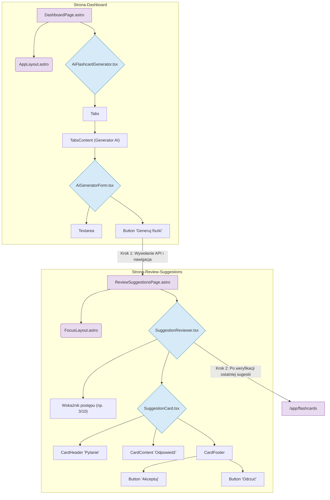

# Plan implementacji widoków: Generator AI i Weryfikacja Sugestii

## 1. Przegląd

Ten dokument opisuje plan implementacji dwóch powiązanych ze sobą widoków:

1.  **Dashboard (`/app/dashboard`)**: Centralny punkt aplikacji, gdzie użytkownik może zainicjować proces generowania fiszek za pomocą AI.
2.  **Weryfikacja Sugestii (`/app/review-suggestions`)**: Widok w "trybie skupienia", na którym użytkownik ocenia (akceptuje lub odrzuca) propozycje fiszek wygenerowane przez AI.

Celem jest stworzenie płynnego przepływu, od wprowadzenia tekstu przez użytkownika, poprzez wygenerowanie propozycji, aż do ich weryfikacji i dodania do kolekcji fiszek.

## 2. Routing widoku

- **Dashboard z generatorem AI**: `/app/dashboard`
- **Widok weryfikacji sugestii AI**: `/app/review-suggestions`

Dostęp do obu ścieżek będzie chroniony i możliwy tylko dla zalogowanych użytkowników. Ochrona zostanie zaimplementowana na poziomie middleware Astro.

## 3. Struktura komponentów

Komponenty zostaną zaimplementowane w React z użyciem biblioteki `shadcn/ui` i umieszczone w katalogu `src/components`. Strony Astro będą renderować te komponenty klienckie.



## 4. Szczegóły komponentów

### `AiGeneratorForm.tsx`

- **Opis komponentu**: Formularz umieszczony w zakładce "Generator AI" na dashboardzie. Umożliwia użytkownikowi wprowadzenie tekstu, waliduje go i wysyła do API w celu wygenerowania sugestii.
- **Główne elementy**: `Textarea` z `shadcn/ui` na notatki, `Button` do wysłania formularza, komunikaty walidacyjne.
- **Obsługiwane interakcje**: Wprowadzanie tekstu, kliknięcie przycisku "Generuj fiszki".
- **Obsługiwana walidacja**:
  - Tekst jest wymagany.
  - Minimalna długość tekstu: 20 znaków.
  - Maksymalna długość tekstu: 5000 znaków.
  - Przycisk "Generuj fiszki" jest nieaktywny (`disabled`), jeśli walidacja nie przechodzi pomyślnie.
- **Typy**: `GenerateAiSuggestionsCommand` (do wysłania żądania), `AiSuggestionDto[]` (oczekiwany typ odpowiedzi).
- **Propsy**: Brak. Komponent zarządza własnym stanem formularza.

### `SuggestionReviewer.tsx`

- **Opis komponentu**: Główny komponent widoku `/app/review-suggestions`. Odbiera listę sugestii, zarządza procesem weryfikacji i renderuje listę kart `SuggestionCard`.
- **Główne elementy**: Kontener `div` mapujący sugestie do komponentów `SuggestionCard`, element tekstowy wyświetlający postęp (np. "Weryfikacja 3 z 10").
- **Obsługiwane interakcje**: Komponent nasłuchuje na zdarzenia `onAccept` i `onReject` z komponentów `SuggestionCard`, aby aktualizować stan i usuwać zweryfikowane karty z listy.
- **Obsługiwana walidacja**: Brak.
- **Typy**: Wewnętrznie zarządza stanem `AiSuggestionDto[]`.
- **Propsy**: `initialSuggestions: AiSuggestionDto[]`.

### `SuggestionCard.tsx`

- **Opis komponentu**: Wyświetla pojedynczą sugestię AI (przód i tył) wewnątrz komponentu `Card` z `shadcn/ui`. Zawiera przyciski akcji.
- **Główne elementy**: `Card`, `CardHeader`, `CardContent`, `CardFooter`, dwa komponenty `Button` ("Akceptuj", "Odrzuć").
- **Obsługiwane interakcje**: Kliknięcie przycisku "Akceptuj", kliknięcie przycisku "Odrzuć".
- **Obsługiwana walidacja**: Brak.
- **Typy**: `AiSuggestionDto`.
- **Propsy**:
  - `suggestion: AiSuggestionDto`
  - `onAccept: (id: string) => void`
  - `onReject: (id: string) => void`
  - `isProcessing: boolean` (do wyłączenia przycisków podczas operacji API)

## 5. Typy

Będziemy korzystać z istniejących typów zdefiniowanych w `src/types.ts`. Nie ma potrzeby tworzenia nowych typów DTO.

- **`GenerateAiSuggestionsCommand`**: Używany do budowy ciała żądania `POST /api/ai-suggestions`.
  ```typescript
  export interface GenerateAiSuggestionsCommand {
    text: string;
  }
  ```
- **`AiSuggestionDto`**: Reprezentuje pojedynczą sugestię zwracaną przez API i używaną do renderowania `SuggestionCard`.
  ```typescript
  export type AiSuggestionDto = Omit<Tables<"ai_suggestions">, "source_text_hash">;
  ```
- **`UpdateAiSuggestionCommand`**: Używany do budowy ciała żądania `PATCH /api/ai-suggestions/{id}` w przypadku odrzucenia sugestii.
  ```typescript
  export interface UpdateAiSuggestionCommand {
    status: Enums<"suggestion_status">; // 'rejected'
  }
  ```

## 6. Zarządzanie stanem

Do przekazania danych (listy sugestii) pomiędzy stroną `/app/dashboard` a `/app/review-suggestions` oraz do zarządzania stanem API, wykorzystamy lekki menedżer stanu **Zustand**.

Stworzymy `store` o nazwie `useAiSuggestionsStore`:

- **Stan**:
  - `suggestions: AiSuggestionDto[]`: Przechowuje listę sugestii do weryfikacji.
  - `isLoading: boolean`: Wskazuje, czy trwa generowanie sugestii (dla globalnego feedbacku).
  - `error: string | null`: Przechowuje komunikaty o błędach.
- **Akcje**:
  - `generateSuggestions: (text: string) => Promise<void>`: Funkcja, która wywołuje API, zapisuje wynik w `store` i obsługuje nawigację.
  - `acceptSuggestion: (id: string) => Promise<void>`
  - `rejectSuggestion: (id: string) => Promise<void>`
  - `clearSuggestions: () => void`: Czyści stan po zakończeniu weryfikacji.

Komponent `SuggestionReviewer` będzie pobierał swój stan początkowy z tego `store`. Do obsługi samych wywołań API (mutacji) wewnątrz akcji `store` można dodatkowo użyć `tanstack-query`, aby uprościć obsługę stanu ładowania i błędów dla każdej operacji.

## 7. Integracja API

Interakcja z API będzie odbywać się z `useAiSuggestionsStore`.

1.  **Generowanie sugestii**:

    - **Komponent**: `AiGeneratorForm`
    - **Akcja**: Wywołanie `store.generateSuggestions(text)`.
    - **Endpoint**: `POST /api/ai-suggestions`
    - **Typ żądania**: `GenerateAiSuggestionsCommand`
    - **Typ odpowiedzi (sukces)**: `AiSuggestionDto[]`. Po sukcesie dane są zapisywane w `store`, a aplikacja przechodzi do `/app/review-suggestions`.

2.  **Akceptacja sugestii**:

    - **Komponent**: `SuggestionCard` -> `SuggestionReviewer`
    - **Akcja**: Wywołanie `store.acceptSuggestion(id)`.
    - **Endpoint**: `POST /api/ai-suggestions/{id}/accept`
    - **Typ żądania**: Brak (ID w URL).
    - **Typ odpowiedzi (sukces)**: `FlashcardDto`. Po sukcesie sugestia jest usuwana z lokalnego stanu w `store`.

3.  **Odrzucenie sugestii**:
    - **Komponent**: `SuggestionCard` -> `SuggestionReviewer`
    - **Akcja**: Wywołanie `store.rejectSuggestion(id)`.
    - **Endpoint**: `PATCH /api/ai-suggestions/{id}`
    - **Typ żądania**: `UpdateAiSuggestionCommand` (`{ status: 'rejected' }`)
    - **Typ odpowiedzi (sukces)**: `AiSuggestionDto`. Po sukcesie sugestia jest usuwana z lokalnego stanu w `store`.

## 8. Interakcje użytkownika

- **Użytkownik na `/app/dashboard`**:
  1. Wpisuje tekst w `Textarea`.
  2. Przycisk "Generuj fiszki" staje się aktywny po spełnieniu warunków walidacji.
  3. Po kliknięciu, przycisk pokazuje stan ładowania.
  4. Po pomyślnym wygenerowaniu sugestii następuje automatyczne przekierowanie na `/app/review-suggestions`.
- **Użytkownik na `/app/review-suggestions`**:
  1. Widzi listę kart z sugestiami oraz licznik postępu.
  2. Klika "Akceptuj" lub "Odrzuć" na karcie.
  3. Przyciski na danej karcie stają się nieaktywne na czas operacji API.
  4. Po pomyślnej operacji, karta jest usuwana z listy (np. z animacją).
  5. Licznik postępu jest aktualizowany.
  6. Po przetworzeniu ostatniej karty, następuje automatyczne przekierowanie na `/app/flashcards`.

## 9. Warunki i walidacja

- **Komponent `AiGeneratorForm`**:
  - Walidacja długości tekstu (min 20, max 5000 znaków) będzie realizowana `onChange`.
  - Wynik walidacji będzie kontrolował atrybut `disabled` przycisku "Generuj fiszki".
  - Użytkownik otrzyma wizualny feedback (np. czerwona ramka, komunikat pod polem), jeśli dane będą nieprawidłowe.

## 10. Obsługa błędów

- **Błąd walidacji (400)**: Frontendowa walidacja powinna temu zapobiec. Jeśli jednak wystąpi, należy wyświetlić generyczny komunikat błędu.
- **Błąd autoryzacji (401)**: Middleware przekieruje na stronę logowania. Jeśli sesja wygaśnie w trakcie, `store` powinien obsłużyć błąd, wylogować użytkownika i dokonać przekierowania.
- **Błąd serwera / usługi AI (5xx)**: `store` przechwyci błąd. Należy wyświetlić powiadomienie typu "toast" z informacją, np. "Wystąpił błąd podczas generowania fiszek. Spróbuj ponownie później." Stan ładowania na formularzu zostanie wyłączony.
- **Błąd sieci**: Należy obsłużyć błąd `fetch` i wyświetlić toast, np. "Błąd połączenia. Sprawdź swoje połączenie z internetem."
- **Zasób nie znaleziony (404) przy akceptacji/odrzuceniu**: Może się zdarzyć, gdy sugestia została już przetworzona w innej karcie. Aplikacja powinna cicho usunąć kartę z widoku, ewentualnie wyświetlając dyskretny komunikat.

## 11. Kroki implementacji

1. **Struktura plików**: Stworzenie plików dla nowych komponentów: `AiFlashcardGenerator.tsx`, `AiGeneratorForm.tsx`, `SuggestionReviewer.tsx`, `SuggestionCard.tsx` w `src/components/` oraz stron `dashboard.astro` i `review-suggestions.astro` w `src/pages/app/`.
2. **Zarządzanie stanem**: Implementacja `useAiSuggestionsStore` przy użyciu Zustand do obsługi stanu i logiki API.
3. **Komponent `AiGeneratorForm`**: Budowa formularza z `Textarea` i `Button`. Implementacja logiki walidacji i połączenie z akcją `store.generateSuggestions`.
4. **Komponent `AiFlashcardGenerator`**: Stworzenie komponentu z zakładkami (`Tabs`) i umieszczenie w nim `AiGeneratorForm`.
5. **Strona Dashboard**: Stworzenie strony `/src/pages/app/dashboard.astro`, która importuje i renderuje `<AiFlashcardGenerator client:load />`.
6. **Komponent `SuggestionCard`**: Budowa karty do wyświetlania pojedynczej sugestii, wraz z przekazywaniem zdarzeń przez `props`.
7. **Komponent `SuggestionReviewer`**: Implementacja logiki wyświetlania listy `SuggestionCard`, zarządzanie stanem weryfikacji (pobieranie danych ze `store`), obsługa akcji akceptacji/odrzucenia oraz nawigacja po zakończeniu.
8. **Strona Weryfikacji**: Stworzenie strony `/src/pages/app/review-suggestions.astro`, która renderuje `<SuggestionReviewer client:load />` i używa specjalnego `FocusLayout.astro` (bez nawigacji).
9. **Obsługa błędów i stanów ładowania**: Zapewnienie, że wszystkie stany ładowania (np. na przyciskach) i błędy (np. toasty) są poprawnie obsługiwane zgodnie z planem.
10. **Testowanie przepływu**: Manualne przetestowanie całego przepływu od A do Z, włączając przypadki brzegowe i błędy.
