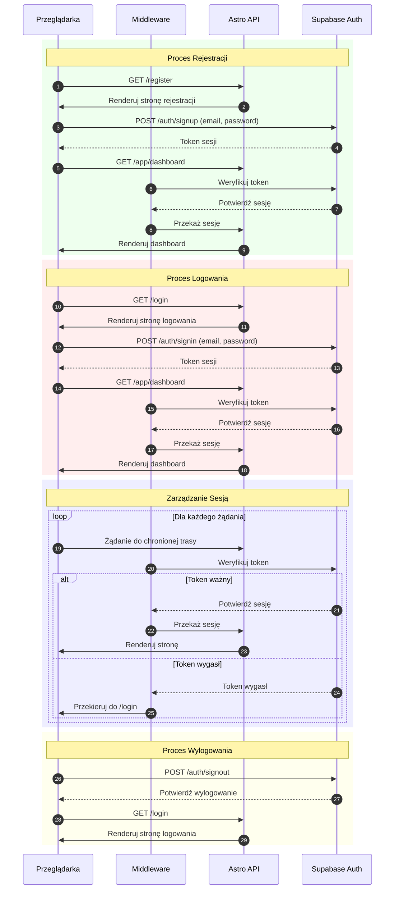

```mermaid
sequenceDiagram
    autonumber
    participant Browser as Przeglądarka
    participant Middleware as Middleware
    participant AstroAPI as Astro API
    participant Supabase as Supabase Auth

    %% Rejestracja
    rect rgba(200, 255, 200, 0.3)
        Note over Browser,Supabase: Proces Rejestracji
        Browser->>AstroAPI: GET /register
        AstroAPI->>Browser: Renderuj stronę rejestracji
        Browser->>Supabase: POST /auth/signup (email, password)
        Supabase-->>Browser: Token sesji
        Browser->>AstroAPI: GET /app/dashboard
        Middleware->>Supabase: Weryfikuj token
        Supabase-->>Middleware: Potwierdź sesję
        Middleware->>AstroAPI: Przekaż sesję
        AstroAPI->>Browser: Renderuj dashboard
    end

    %% Logowanie
    rect rgba(255, 200, 200, 0.3)
        Note over Browser,Supabase: Proces Logowania
        Browser->>AstroAPI: GET /login
        AstroAPI->>Browser: Renderuj stronę logowania
        Browser->>Supabase: POST /auth/signin (email, password)
        Supabase-->>Browser: Token sesji
        Browser->>AstroAPI: GET /app/dashboard
        Middleware->>Supabase: Weryfikuj token
        Supabase-->>Middleware: Potwierdź sesję
        Middleware->>AstroAPI: Przekaż sesję
        AstroAPI->>Browser: Renderuj dashboard
    end

    %% Sesja i Odświeżanie Tokenu
    rect rgba(200, 200, 255, 0.3)
        Note over Browser,Supabase: Zarządzanie Sesją
        loop Dla każdego żądania
            Browser->>AstroAPI: Żądanie do chronionej trasy
            Middleware->>Supabase: Weryfikuj token
            alt Token ważny
                Supabase-->>Middleware: Potwierdź sesję
                Middleware->>AstroAPI: Przekaż sesję
                AstroAPI->>Browser: Renderuj stronę
            else Token wygasł
                Supabase-->>Middleware: Token wygasł
                Middleware->>Browser: Przekieruj do /login
            end
        end
    end

    %% Wylogowanie
    rect rgba(255, 255, 200, 0.3)
        Note over Browser,Supabase: Proces Wylogowania
        Browser->>Supabase: POST /auth/signout
        Supabase-->>Browser: Potwierdź wylogowanie
        Browser->>AstroAPI: GET /login
        AstroAPI->>Browser: Renderuj stronę logowania
    end
```
