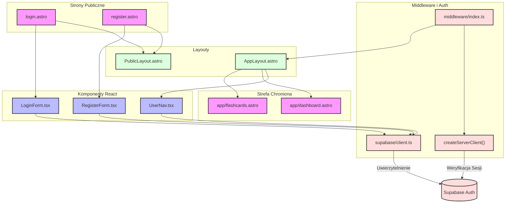

```mermaid
flowchart TD
    subgraph "Strony Publiczne"
        login["login.astro"]
        register["register.astro"]
    end

    subgraph "Komponenty React"
        LoginForm["LoginForm.tsx"]
        RegisterForm["RegisterForm.tsx"]
        UserNav["UserNav.tsx"]
    end

    subgraph "Layouty"
        PublicLayout["PublicLayout.astro"]
        AppLayout["AppLayout.astro"]
    end

    subgraph "Middleware i Auth"
        middleware["middleware/index.ts"]
        supabaseClient["supabase/client.ts"]
        supabaseServer["createServerClient()"]
    end

    subgraph "Strefa Chroniona"
        dashboard["app/dashboard.astro"]
        flashcards["app/flashcards.astro"]
    end

    %% Połączenia stron publicznych
    login --> PublicLayout
    register --> PublicLayout
    login --> LoginForm
    register --> RegisterForm

    %% Połączenia komponentów React z Supabase
    LoginForm --> supabaseClient
    RegisterForm --> supabaseClient
    UserNav --> supabaseClient

    %% Przepływ middleware
    middleware --> supabaseServer
    middleware --> AppLayout

    %% Ochrona stref
    AppLayout --> UserNav
    AppLayout --> dashboard
    AppLayout --> flashcards

    %% Przepływ autentykacji
    supabaseClient -- "Uwierzytelnienie" --> SupabaseAuth[("Supabase Auth")]
    supabaseServer -- "Weryfikacja Sesji" --> SupabaseAuth

    %% Style
    classDef page fill:#f9f,stroke:#333,stroke-width:2px
    classDef component fill:#bbf,stroke:#333,stroke-width:2px
    classDef layout fill:#dfd,stroke:#333,stroke-width:2px
    classDef auth fill:#fdd,stroke:#333,stroke-width:2px

    class login,register,dashboard,flashcards page
    class LoginForm,RegisterForm,UserNav component
    class PublicLayout,AppLayout layout
    class middleware,supabaseClient,supabaseServer,SupabaseAuth auth
```
